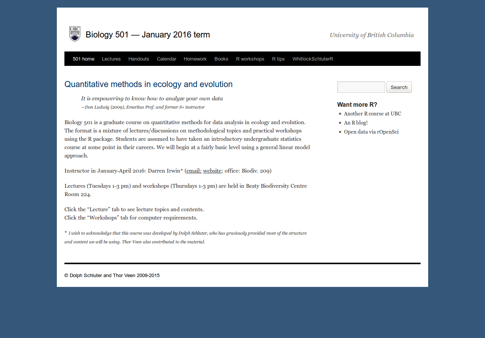
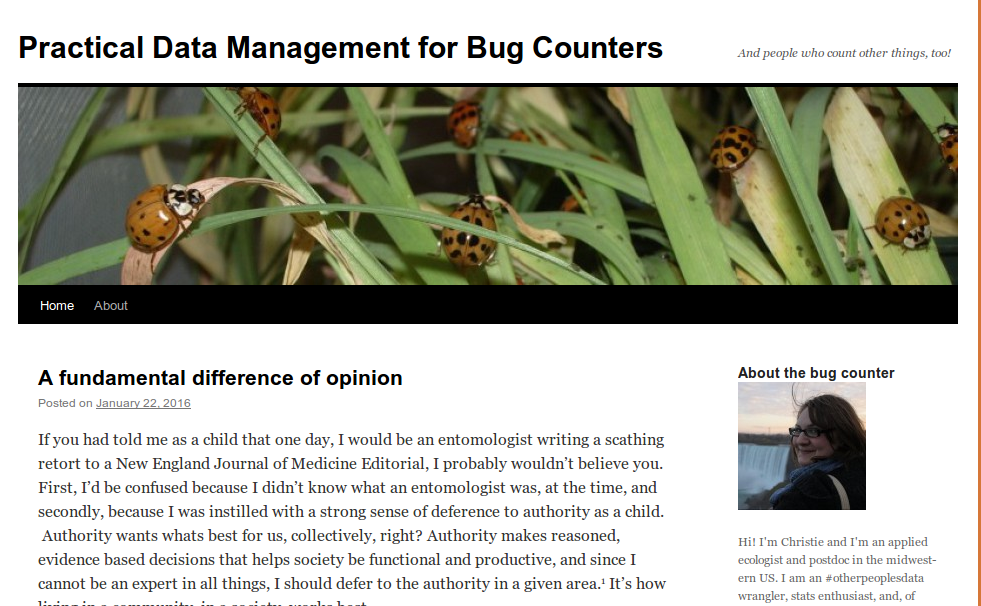
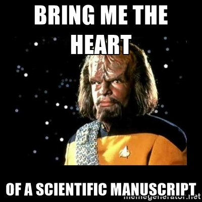

## Plan for today

* Hello everyone
* What this course isn't (and is) about
* Why Data skills are important
* Rubric
* `git`

# This course is not..

## a class in statistics {.flexbox .vcenter}

<a href="https://www.zoology.ubc.ca/~bio501/R/">
</img>
</a>

## a class in programming with R

<a href="http://stat545-ubc.github.io/">
</img>
</a>

## a class in Open Science

<a href="https://github.com/cbahlai/OSRR_course">
</img>
</a>

## Data skills for biologists {.build}

This class borrows heavily from all those I just described, but is focussed on biologists:

* Version control
* Data manipulation
* Metadata
* Data checking
* Data archiving
* Licences

## Course Evaluation

| percentage | task                                      |
| :--------: | :---:                                     |
| 50         | Homework 3 (final project)                |
| 25         | grades from Peer review  (3)              |
| 20         | grades given to your own peer reviews (3) |
| 5          | Participation                                          |

| Peer Reviews and homeworks | contribution to respective mark |
| :--------: | :-------------------: |
| 1 | 10 |
| 2 | 40 | 
| 3 | 50 |  

# Core principles of the course

## Data for computers

> If I had one thing to tell biologists learning bioinformatics, it would be "write code for humans, write data for computers". — Vince Buffalo (@vsbuffalo)

## Data should (but doesn't) last forever

<a href="http://www.sciencedirect.com/science/article/pii/S0960982213014000">
</img>
</a>

Vines et al 2014. The Availability of Research Data Declines Rapidly with Article Age. Current Biology

## Version Control

>  we hope to convince you that although mastering a given VCS takes time, you can already achieve great benefits by getting started using a few simple commands.
- Blischak et al, 2016

## Recommended reading

* [Ten simple rules for digital data storage](http://journals.plos.org/ploscompbiol/article?id=10.1371/journal.pcbi.1005097) Hart et al., 2016, PLoS Comput Biol.

<a href="http://journals.plos.org/ploscompbiol/article?id=10.1371/journal.pcbi.1005097">
</img>
</a>

## (first 5) ten simple rules:

1. Anticipate How Your Data Will Be Used
2. Know Your Use Case
3. Keep Raw Data Raw
4. Store Data in Open Formats
5. Data Should Be Structured for Analysis

## Your task for Thursday

## Your task for Thursday

